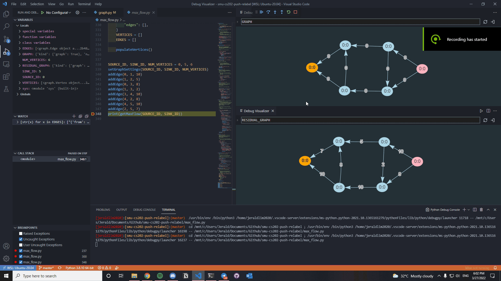

# Max Flow Algorithm (Push-Relabel)
> Push relabel is an algorithm that computes maximum flow in a flow network. It's considered one of the most efficient maximum flow algorithms that is able to achieve O(V^E) time complexity which is asymptopically more efficient than O(VE^2) Edmonds-Karp algorithm that adopts breadth-first search (BFS). ([Source](https://en.wikipedia.org/wiki/Push%E2%80%93relabel_maximum_flow_algorithm))

## Visualization
[Debug Visualizer](https://marketplace.visualstudio.com/items?itemName=hediet.debug-visualizer) is used in this demonstration to better visualize the underlying implementation and data structure of *Push-Relabel* algorithm. Vertices are displayed with labels (Height : Excess Flow)

**Graph Color Legend**
- Red - Adjacent vertex that is selected to receive excess flow
- Light Blue - Normal vertex in the graph
- Light Green - Currently selected vertex
- Light Yellow - Adjacent vertices of the currently selected vertex
- Light Pink - Source vertex
- Orange - Sink vertex

**Demo**


## Setup
Since this application relies heavily on *Debug Visualizer*, breakpoints are required to be set in order to enter debug mode and notice what happens in each step of the algorithm.

**Breakpoints**
- [Line 237](https://github.com/jeraldlyh/smu-cs202-push-relabel/blob/master/max_flow.py#L237) - Shows which vertex has been selected with its adjacent vertices
- [Line 300](https://github.com/jeraldlyh/smu-cs202-push-relabel/blob/master/max_flow.py#L300) - Reflects the changes of the graphs till none of the vertices have excess flow
- [Line 348](https://github.com/jeraldlyh/smu-cs202-push-relabel/blob/master/max_flow.py#L348) - Shows the final flow network graph with its corresponding residual graph

## Steps to Replicate
1. Install [Debug Visualizer](https://marketplace.visualstudio.com/items?itemName=hediet.debug-visualizer)
2. ```git clone https://github.com/jeraldlyh/smu-cs202-push-relabel```
3. Select [max_flow.py](https://github.com/jeraldlyh/smu-cs202-push-relabel/blob/master/max_flow.py)
4. Set the respective breakpoints
5. Ctrl + Shift + P -> Debug: Start Debugging
6. Ctrl + Shift + P -> Debug Visualizer: New View
7. Enter *GRAPH* into input box
8. Ctrl + Shift + P -> Debug Visualizer: New View
9. Enter *RESIDUAL_GRAPH* into input box
10. Shift + F10 to reflect changes in the graph

## Contributors
- [Daryl Wong](https://github.com/wongdaryl)
- [Felice Png](https://github.com/felicepng)
- [Jerald Lim](https://github.com/jeraldlyh)
- [Yvonne Lim](https://github.com/yvonnelhs)